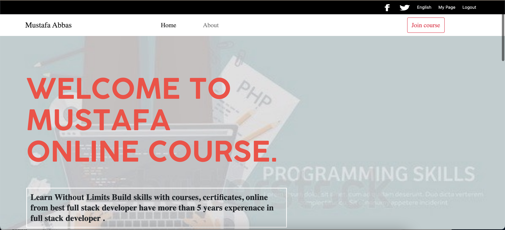

# Project Name

> MUSTAFA ONLINE COURSE.

This website build for provide online course.

## Built With

-  HTML,CSS,JavaScript
-  Visual Studio Code: A source code editor
-  git: A tool for managing source code

## Live Demo

[Live Demo Link](https://mustabbas.github.io/course/)

## Getting Started

**If you installed git you can clone the code to your machine, or download a ZIP of all the files directly.

Download the ZIP from this location, or run the following git command to clone the files to your machine:

git clone https://github.com/mustabbas/course.git
Once the files are on your machine, open the course folder in Visual Studio Code.

With the files open in Visual Studio Code, press the Go Live button at the bottom of the window to launch the files with Live Server.**

To get a local copy up and running follow these simple example steps.

### Prerequisites

### Setup

### Install

### Usage

### Run tests

### Deployment

## Authors

👤 **MUSTAFA ABBAS**

- GitHub: [@githubhandle](https://github.com/mustabbas)
- LinkedIn: [LinkedIn](https://www.linkedin.com/in/mustafa-abbas-7555ba10a)

## 🤝 Contributing

Contributions, issues, and feature requests are welcome!

Feel free to check the [issues page](https://github.com/mustabbas/course/issues).

## Show your support

Give a ⭐️ if you like this project!

## 📝 License

This project is [MIT](./MIT.md) licensed.
